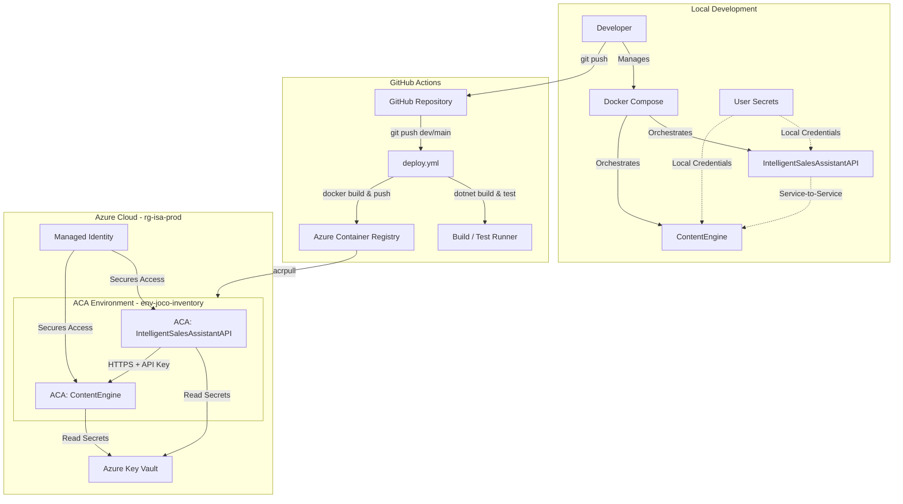

# Intelligent Sales Assistant Platform

[Svenska](README.md) | [English](README.en.md) | [Enkel version](README.simple.md) | [Portfolio](README.portfolio.md)

> A distributed microservices platform for AI-powered website generation and sales content creation

[](https://dotnet.microsoft.com/)
[](LICENSE)
[](docs)

---

### System Overview



---

## Overview

Intelligent Sales Assistant Platform is a production-ready microservices system that automates sales workflows through AI-powered content generation. The platform fetches real-time company data from Swedish business registries and uses Google's Gemini AI to generate professional websites and marketing materials.

**Core Capabilities:**
- Automated company research via BolagsAPI (Swedish Company Registry)
- AI-powered website generation with customizable themes
- Marketing content creation (social media posts, emails, newsletters)
- RESTful API with comprehensive OpenAPI documentation
- JWT authentication and role-based access control

---

## Architecture

The platform implements a **microservices architecture** with two independent services communicating via HTTP:

```
┌─────────────────────────────────────────────────────────────┐
│           IntelligentSalesAssistantAPI (Port 5267)          │
│                   Core API & Business Logic                 │
│                                                             │
│  ┌──────────────┐  ┌──────────────┐  ┌──────────────┐       │
│  │  Company     │  │   Website    │  │   Content    │       │
│  │  Research    │  │  Generator   │  │    Drafts    │       │
│  └──────────────┘  └──────────────┘  └──────────────┘       │
│         │                  │                  │             │
│         └──────────────────┴──────────────────┘             │
│                            │                                │
│                   ┌────────▼────────┐                       │
│                   │  LlmProxyClient │                       │
│                   │  (Typed Client) │                       │
│                   └────────┬────────┘                       │
└────────────────────────────┼────────────────────────────────┘
                             │ HTTPS + API Key
                             │ (Proxy Pattern)
┌────────────────────────────▼────────────────────────────────┐
│    IntelligentSalesAssistant.ContentEngine (Port 5006)      │
│                     AI Content Engine                       │
│                                                             │
│                   ┌────────────────┐                        │
│                   │ GeminiClient   │                        │
│                   │  (Typed HTTP)  │                        │
│                   └────────┬───────┘                        │
│                            │                                │
│                   ┌────────▼───────┐                        │
│                   │  Gemini API    │                        │
│                   │  (Google AI)   │                        │
│                   └────────────────┘                        │
└─────────────────────────────────────────────────────────────┘
```

### IntelligentSalesAssistantAPI
- **Responsibility:** Business logic, data orchestration, user authentication
- **Technology:** ASP.NET Core Web API, Entity Framework Core, SQLite
- **Endpoints:** Company research, website generation, content drafts
- **Security:** JWT authentication with Admin and Seller roles

### IntelligentSalesAssistant.ContentEngine
- **Responsibility:** AI content generation proxy
- **Technology:** ASP.NET Core Web API, Google Gemini API integration
- **Endpoints:** Text generation, structured website content
- **Security:** API key validation for service-to-service communication

---

## Key Features

### Automated Company Research
- Fetches real-time data from BolagsAPI (Swedish Company Registry)
- Caches research results in-memory for session duration
- Provides structured company information (name, organization number, address, industry)

### AI-Powered Website Generation
- Generates complete HTML/CSS/JavaScript websites
- Customizable tone (professional, friendly, bold) and target audience
- Responsive design with mobile-first templates
- Websites saved to `Site/generated/{company-name}/index.html`

### Marketing Content Creation
- Creates social media posts (Facebook, Instagram, LinkedIn)
- Generates emails, blog posts, and newsletters
- Content references generated websites for consistent messaging
- Drafts saved to `Site/drafts/{company-name}/{type}_{timestamp}.txt`

### Lean JSON Architecture
Service communication is optimized for performance:
- **IntelligentSalesAssistant.ContentEngine** returns structured JSON (3-5 KB)
- **IntelligentSalesAssistantAPI** builds HTML locally from templates
- **Result:** 10-20x smaller payloads compared to transferring complete HTML files

**Benefits:**
- Reduced network overhead and faster response times
- Lower bandwidth costs in cloud deployments
- Clear separation of concerns (content intelligence vs. presentation)
- Independent scaling based on actual service load

---

## Technology Stack

| Category | Technology |
|----------|------------|
| **Framework** | .NET 9.0 |
| **Language** | C# 12 |
| **API** | ASP.NET Core Web API |
| **ORM** | Entity Framework Core |
| **Database** | SQLite |
| **HTTP Client** | IHttpClientFactory with Typed Clients |
| **Resilience** | Polly (Retry, Circuit Breaker, Timeout) |
| **Authentication** | JWT Bearer Tokens |
| **API Documentation** | Scalar (OpenAPI 3.0) |
| **AI Provider** | Google Gemini API (gemini-3.1-flash-lite-preview) |
| **External APIs** | BolagsAPI (Swedish Company Registry) |

---

## Getting Started

### Prerequisites

- [.NET 9 SDK](https://dotnet.microsoft.com/download/dotnet/9.0) or later
- [Git](https://git-scm.com/)
- API Keys:
  - [Google Gemini API Key](https://ai.google.dev/)
  - [BolagsAPI Key](https://bolagsapi.se/)

### Installation

1. **Clone the repository**
   ```bash
   git clone https://github.com/JocoBorghol/AI-Microservices.git
   cd AI-Microservices
   ```

2. **Restore NuGet packages**
   ```bash
   dotnet restore
   ```
   This ensures all dependencies are downloaded locally before configuration.

3. **Configure User Secrets for IntelligentSalesAssistantAPI**
   ```bash
   cd IntelligentSalesAssistantAPI
   dotnet user-secrets init
   dotnet user-secrets set "Jwt:Key" "your-super-secret-jwt-key-min-32-characters"
   dotnet user-secrets set "AdminPassword" "your-admin-password"
   dotnet user-secrets set "SellerPassword" "your-seller-password"
   dotnet user-secrets set "BolagsApi:ApiKey" "your-bolagsapi-key"
   dotnet user-secrets set "LlmProxySettings:ApiKey" "your-service-b-api-key"
   ```

4. **Configure User Secrets for IntelligentSalesAssistant.ContentEngine**
   ```bash
   cd ../IntelligentSalesAssistant.ContentEngine
   dotnet user-secrets init
   dotnet user-secrets set "GeminiSettings:ApiKey" "your-gemini-api-key"
   dotnet user-secrets set "ServiceAuth:ApiKey" "your-service-b-api-key"
   ```
   
   > **Note:** The `ServiceAuth:ApiKey` in ContentEngine must match `LlmProxySettings:ApiKey` in IntelligentSalesAssistantAPI
   
   > **LLM Integration Note:** The `GeminiSettings:ApiKey` is essential for the AI Content Engine to communicate with Google's Gemini API. Without this secret, the platform will not be able to generate content.

5. **Apply Database Migrations**
   ```bash
   cd ../IntelligentSalesAssistantAPI
   dotnet ef database update
   ```

### Running the Services

**Terminal 1 - IntelligentSalesAssistantAPI:**
```bash
cd IntelligentSalesAssistantAPI
dotnet run
```
Service starts on `http://localhost:5267`

**Terminal 2 - IntelligentSalesAssistant.ContentEngine:**
```bash
cd IntelligentSalesAssistant.ContentEngine
dotnet run
```
Service starts on `http://localhost:5006`

### Running with Docker Compose (Alternative)
```bash
# Build and start both microservices in the background from the root folder
docker-compose up -d --build
```

### Verify Installation

- **IntelligentSalesAssistantAPI:** `http://localhost:5267/scalar/v1`
- **IntelligentSalesAssistant.ContentEngine:** `http://localhost:5006/scalar/v1`

---

## Quick Start Guide

### 1. Authenticate

```bash
curl -X POST http://localhost:5267/api/auth/login \
  -H "Content-Type: application/json" \
  -d '{
    "username": "admin",
    "password": "your-admin-password"
  }'
```

Save the returned JWT token.

### 2. Research a Company

```bash
curl -X POST http://localhost:5267/api/research \
  -H "Content-Type: application/json" \
  -H "Authorization: Bearer YOUR_TOKEN" \
  -d '{
    "orgNumber": "5565093902"
  }'
```

This fetches company data from BolagsAPI and caches it in-memory.

### 3. Generate a Website

```bash
curl -X POST http://localhost:5267/api/websites \
  -H "Content-Type: application/json" \
  -H "Authorization: Bearer YOUR_TOKEN" \
  -d '{
    "customization": {
      "tone": "professional and welcoming",
      "targetAudience": "families with children",
      "topServices": ["Candy", "Chocolate", "Gift Cards"],
      "keywords": ["quality", "tradition", "joy"]
    }
  }'
```

### 4. View the Generated Website

Open the URL from the response:
```
http://localhost:5267/generated/kandyz-ab/index.html
```

### 5. Create Marketing Content

```bash
curl -X POST http://localhost:5267/api/content/drafts \
  -H "Content-Type: application/json" \
  -H "Authorization: Bearer YOUR_TOKEN" \
  -d '{
    "contentType": "facebook_post",
    "instructions": "Create a fun post about our summer opening hours",
    "tone": "casual",
    "websiteId": 1
  }'
```

---

## API Documentation

### IntelligentSalesAssistantAPI Endpoints

| Endpoint | Method | Description |
|----------|--------|-------------|
| `/api/auth/login` | POST | Generate JWT token |
| `/api/research` | POST | Fetch company data from BolagsAPI |
| `/api/research/cache` | GET | Retrieve cached company data |
| `/api/research/cache` | DELETE | Clear cached company data |
| `/api/websites` | GET | List all generated websites |
| `/api/websites` | POST | Generate a new website |
| `/api/websites/{id}` | GET | Get website details |
| `/api/websites/{id}` | PUT | Regenerate website |
| `/api/websites/{id}` | DELETE | Delete website |
| `/api/content/drafts` | POST | Create content draft (requires websiteId) |
| `/api/content/drafts` | GET | List all drafts |
| `/api/content/drafts/{id}` | GET | Get draft content |
| `/api/content/drafts/{id}` | DELETE | Delete draft |

### IntelligentSalesAssistant.ContentEngine Endpoints

| Endpoint | Method | Description |
|----------|--------|-------------|
| `/api/content/generate` | POST | Generate AI text content |
| `/api/content/websites` | POST | Generate structured website content |

For detailed API documentation with examples, visit `http://localhost:5267/scalar/v1` after starting the services.

---

## Custom Exception Middleware

The platform implements a centralized Custom Exception Middleware to ensure robust error handling and security. Instead of exposing raw stack traces, the middleware intercepts all exceptions and transforms them into standardized **RFC 7807 Problem Details** responses.

**Architecture:** The middleware is registered in the `Program.cs` request pipeline. It utilizes a `try-catch` block that wraps the `next(context)` delegate, ensuring that any exception thrown during the request lifecycle is caught, logged, and mapped to a structured `ProblemDetails` response using the `Microsoft.AspNetCore.Mvc.ProblemDetails` class.

**Key Benefits:**
- **Security:** Prevents sensitive system information from leaking to the client
- **Consistency:** Provides a uniform error format across all microservices
- **Clarity:** Maps specific domain exceptions (e.g., `FileOperationException`, `CompanyNotFoundException`) to appropriate HTTP status codes

**How to trigger and verify (Test):**
1. Authenticate via `/api/auth/login` to get a JWT token
2. Call `POST /api/research` but provide a malformed or non-existent organization number (e.g., `"000"`)
3. Observe the response: The API will return a structured JSON object with `title`, `status`, and `detail` fields instead of a generic error page

**Example Error Response:**
```json
{
  "type": "https://tools.ietf.org/html/rfc7231#section-6.5.4",
  "title": "Företag hittades inte",
  "status": 404,
  "detail": "Företag med organisationsnummer 000 hittades inte i BolagsAPI"
}
```

---

## Security

### Authentication Flow
1. User authenticates with `/api/auth/login` and receives a JWT token
2. JWT token included in `Authorization: Bearer {token}` header for subsequent requests
3. IntelligentSalesAssistantAPI validates JWT token and extracts user identity
4. IntelligentSalesAssistantAPI adds API key when communicating with ContentEngine
5. ContentEngine validates API key before processing requests

### Security Features
- JWT tokens with 2-hour expiration
- Role-based access control (Admin and Seller roles)
- API key validation for service-to-service communication
- Input validation with Data Annotations
- SQL injection prevention via Entity Framework Core
- Rate limiting (10 requests/minute per endpoint)

### How to set the API Key locally (User Secrets)
During local development, all sensitive keys are stored outside the project folder using .NET User Secrets to prevent them from being accidentally committed to Git.
1. Go to the API project directory:
   ```bash
   cd IntelligentSalesAssistantAPI
   ```
2. Set the API key for communicating with Service B (Content Engine):
   ```bash
   dotnet user-secrets set "LlmProxySettings:ApiKey" "your_local_secret_key"
   ```
This key is automatically loaded into `IConfiguration` during development via the unique `UserSecretsId` in `.csproj`.

### How to set the API Key in production (Environment Variables)
When running the system in production in **Azure Container Apps (ACA)**:
- The application automatically reads settings from Environment Variables, where e.g., `LlmProxySettings__ApiKey` maps to `LlmProxySettings:ApiKey` in the configuration.
- **Best Practice**: Keys are stored securely in **Azure Key Vault** and bound to environment variables in Azure Container Apps using a system-assigned **Managed Identity**, ensuring the application never handles raw passwords or key files in code or deployment scripts.

### CI/CD via GitHub Actions
The pipeline (.github/workflows/deploy.yml) automatically builds, tests, and deploys both microservices on pull requests and push events to the `dev` and `main` branches. To make this work:
1. Create a Service Principal in Azure CLI:
   ```bash
   az ad-sp create-for-rbac --name "github-actions-deploy" --role contributor --scopes /subscriptions/fdd80a6b-225f-4078-a232-5c3272145e4c/resourceGroups/rg-isa-prod --sdk-auth
   ```
2. Copy the resulting JSON.
3. Go to your GitHub repository: **Settings > Secrets and variables > Actions**.
4. Create a new secret named `AZURE_CREDENTIALS` and paste the JSON.

### Written Security Guarantee
It is hereby certified and guaranteed that:
- No raw API keys or secrets are or will be checked into the Git repository (all local configuration is done via User Secrets or environment-specific placeholders).
- All API clients and HTTP handlers (`ApiKeyHandler`, `BolagsApiAuthHandler`) and our global middleware (`CustomExceptionMiddleware`) are manually and programmatically verified to **never** log sensitive HTTP headers (e.g., `Authorization`, `X-Api-Key`) or raw request bodies containing user data and tokens. Only secure, anonymized error messages are logged in the system.

---

## Project Structure

```
AI-Microservices/
├── IntelligentSalesAssistantAPI/             # Core API Service
│   ├── Controllers/                          # API Controllers
│   │   ├── AuthController.cs                 # JWT Authentication
│   │   ├── CompanyResearchController.cs      # BolagsAPI Integration
│   │   ├── WebsiteGeneratorController.cs     # Website Generation
│   │   └── ContentDraftController.cs         # Content Drafts
│   ├── Services/                             # Business Logic
│   │   ├── Enrichment/                       # Company Research
│   │   ├── WebsiteGenerator/                 # Website Generation
│   │   └── ContentDraft/                     # Content Drafts
│   ├── Http/Clients/                         # Typed HTTP Clients
│   ├── DTOs/                                 # Data Transfer Objects
│   ├── Data/                                 # Database Context
│   ├── Models/                               # Entity Models
│   │   └── CompanyWebsite.cs                 # Website Entity
│   ├── Middleware/                           # Custom Middleware
│   ├── Filters/                              # Action Filters
│   ├── Exceptions/                           # Custom Exceptions
│   ├── Migrations/                           # EF Core Migrations
│   ├── ServiceA.db                           # SQLite Database
│   └── Program.cs                            # Application Entry Point
│
├── IntelligentSalesAssistant.ContentEngine/  # AI Content Engine
│   ├── Controllers/                          # API Controllers
│   │   └── ContentController.cs              # AI Content Generation
│   ├── ApiClients/                           # Gemini Client
│   │   ├── GeminiClient.cs                   # Gemini API Integration
│   │   └── IGeminiClient.cs                  # Interface
│   ├── Security/                             # API Key Validation
│   │   └── RequireApiKeyAttribute.cs         # API Key Filter
│   ├── Middleware/                           # Custom Middleware
│   ├── DTOs/                                 # Data Transfer Objects
│   └── Program.cs                            # Application Entry Point
│
├── Site/                                     # Generated Content
│   ├── template/                             # Website Templates
│   │   └── index.html                        # Base Template
│   ├── generated/                            # Generated Websites
│   │   └── {company-name}/                   # Per-company folders
│   │       └── index.html                    # Generated Website
│   └── drafts/                               # Content Drafts
│       └── {company-name}/                   # Per-company folders
│           └── {type}_{timestamp}.txt        # Draft Files
│
└── README.md                                 # Main README
```

---

## Testing

### Manual Testing with Scalar

1. Start both services
2. Navigate to `http://localhost:5267/scalar/v1`
3. Click "Authorize" and enter your JWT token
4. Test endpoints directly from the interactive documentation

### Example Test Flow

**Complete Website Generation:**
1. POST `/api/auth/login` - Authenticate and get JWT token
2. POST `/api/research` - Fetch company data (caches in-memory)
3. POST `/api/websites` - Generate website using cached data
4. GET `/api/websites` - List all generated websites
5. Open generated website in browser

**Content Draft Creation:**
1. POST `/api/auth/login` - Authenticate
2. POST `/api/research` - Fetch company data
3. POST `/api/websites` - Generate website
4. POST `/api/content/drafts` - Create content (using websiteId from step 3)
5. GET `/api/content/drafts/{id}` - View generated content

---

## Contributing

This is a portfolio project demonstrating microservices architecture and AI integration. Feedback and suggestions are welcome!

---

## Author

**Joco Borghol**
- LinkedIn: [linkedin.com/in/joco-borghol-777b59386](https://www.linkedin.com/in/joco-borghol-777b59386)
- GitHub: [@JocoBorghol](https://github.com/JocoBorghol)

---

## Acknowledgments

- **Google Gemini AI** - AI content generation
- **BolagsAPI** - Swedish company registry data
- **Scalar** - API documentation
- **Polly** - Resilience and transient-fault-handling

---

<div align="center">

**Built with .NET 9 and modern microservices architecture**

[⬆ Back to Top](#intelligent-sales-assistant-platform)

</div>
