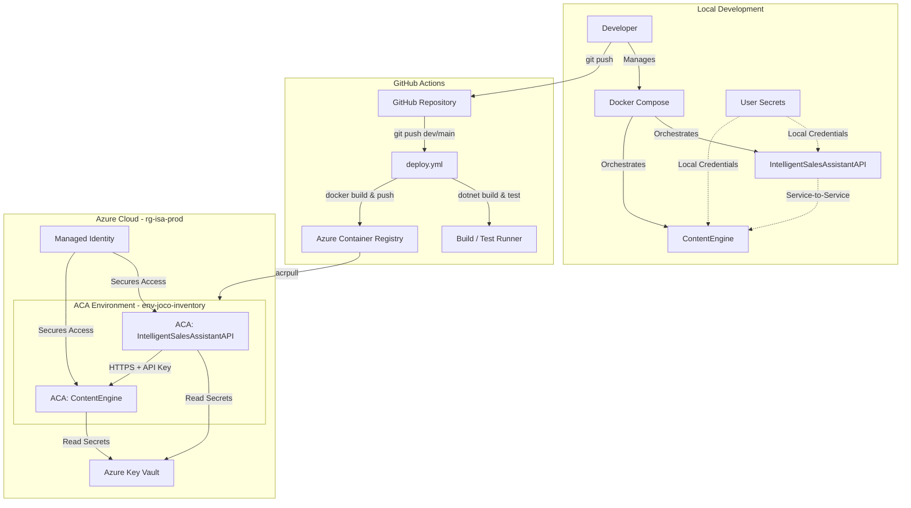

# Intelligent Sales Assistant - Portfolio Edition

[English](README.md) | [Svenska](README.sv.md) | [Enkel version (Svenska)](README.simple.md) | [Portfolio (English)](README.portfolio.md)

Distributed microservices platform built using **.NET 9** and **C# 12** for automated B2B sales workflows. It integrates Swedish company registry data (BolagsAPI) with Google's Gemini AI to dynamically generate customized websites and sales/marketing content.

---

### System Overview

---

## Technical Architecture & Core Concepts

### Microservices Architecture
The system consists of two independent services communicating over HTTP:
* **Service A (IntelligentSalesAssistantAPI)**: Core orchestrator, handles business workflows, user authentication (JWT), database operations (EF Core & SQLite), and consumes Service B.
* **Service B (ContentEngine)**: Dedicated AI content generation proxy interacting directly with the Google Gemini API.

### Lean Payload Design (JSON vs HTML)
To optimize inter-service communication:
* Service B executes structured Gemini calls and returns lightweight JSON schemas (3-5 KB).
* Service A performs local HTML rendering using pre-configured templates.
* **Result**: Reduces payload sizes by 90-95%, significantly cutting bandwidth costs and network overhead.

### Security Hardening & Best Practices
* **Zero Hardcoded Secrets**: Uses .NET User Secrets during local development and Azure Key Vault in production.
* **Service-to-Service Handshake**: Secured via custom `DelegatingHandler` (`ApiKeyHandler`) injecting API keys dynamically into outgoing HTTP headers (`X-Api-Key`).
* **Safe Logging**: Handlers and custom exception middleware are programmatically verified to prevent logging sensitive headers (e.g. `Authorization`, `X-Api-Key`) or raw request/response bodies.
* **Resilience Framework**: Implements Polly policies (Retry, Circuit Breaker, Timeout) using `Microsoft.Extensions.Http.Resilience`.
* **Rate Limiting**: Protects public endpoints from brute-force/abuse via fixed-window rate limiting.

### Deployment & Cloud Scale to Zero
* **Azure Container Apps (ACA)**: Deployed to a shared container environment (`env-joco-inventory`) inside resource group `rg-isa-prod`.
* **Scale to Zero**: Cost-optimized using container scaling properties (`min-replicas: 0`, `max-replicas: 3`). Containers automatically scale to 0 instances during periods of inactivity to completely eliminate idle hosting costs.
* **Secure Registry Integration**: ACR integration uses system-assigned Managed Identity with `acrpull` permissions, avoiding the use of static administrator credentials.

---

## Technical Stack
* **Framework**: .NET 9.0 (C# 12)
* **Web Services**: ASP.NET Core Web API (Controllers & Minimal APIs)
* **Data Access**: Entity Framework Core, SQLite
* **API Documentation**: Scalar (OpenAPI 3.0)
* **Resilience**: Polly
* **AI Provider**: Google Gemini API via typed HttpClient

---

## Contact Information

**Joco Borghol**
* **LinkedIn**: [linkedin.com/in/joco-borghol-777b59386](https://www.linkedin.com/in/joco-borghol-777b59386)
* **GitHub**: [@JocoBorghol](https://github.com/JocoBorghol)
