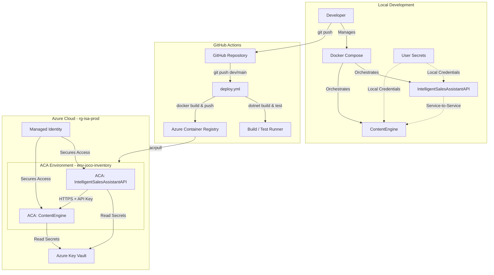

# Intelligent Sales Assistant - Portfolio Edition

[English](README.md) | [Svenska](README.sv.md) | [Enkel version (Svenska)](README.simple.md) | [Portfolio (English)](README.portfolio.md)

Distributed microservices platform built using **.NET 9** and **C# 12** for automated B2B sales workflows. It integrates Swedish company registry data (BolagsAPI) with Google's Gemini AI to dynamically generate customized websites and sales/marketing content.

---

### System Overview



---

## Technical Architecture & Core Concepts

### Microservices Architecture
The system consists of two independent services communicating over HTTP:
* **Service A (IntelligentSalesAssistantAPI)**: Core orchestrator, handles business workflows, user authentication (JWT), database operations (EF Core & SQLite), and consumes Service B.
* **Service B (ContentEngine)**: Dedicated AI content generation proxy interacting directly with the Google Gemini API.

### Lean Payload Design (JSON vs HTML)
To optimize inter-service communication:
* Service B executes structured Gemini calls and returns lightweight JSON schemas (3-5 KB).
* Service A performs local HTML rendering using pre-configured templates.
* **Result**: Reduces payload sizes by 90-95%, significantly cutting bandwidth costs and network overhead.

### Smart Token Optimization & Cost Efficiency
I implement an intelligent adaptive prompt strategy to minimize AI token consumption:

**Dual-Strategy Approach:**
* **Fast Strategy (Simple Companies):** Minimal prompts (~500-800 tokens) for companies with basic data → 5-15 second generation, ~$0.0001 per website
* **Rich Strategy (Complex Companies):** Detailed prompts (~1,500-2,500 tokens) for companies with extensive data → 15-30 second generation, ~$0.0003 per website

**Automatic Strategy Selection:**
```csharp
var hasRichData = !string.IsNullOrEmpty(request.Ceo) || 
                 request.Employees.HasValue || 
                 (request.TopServices?.Count > 0);
var strategy = hasRichData ? "COMPLEX" : "FAST";
```

**Template-Based Rendering:**
Instead of asking AI to generate HTML, I request only content (titles, descriptions, services) as JSON and fill pre-built HTML templates. This approach:
* Reduces token usage by 85-90% for simple companies
* Ensures 60-second timeout is sufficient for all scenarios
* Enables cost-effective scaling for high-volume processing

### Security Hardening & Best Practices
* **Zero Hardcoded Secrets**: Uses .NET User Secrets during local development and Azure Key Vault in production.
* **Distroless & Rootless Containers**: The final containers use `mcr.microsoft.com/dotnet/aspnet:9.0-noble-chiseled` (Ubuntu Chiseled) to eliminate shell commands (`sh`/`bash`) and package managers (`apt`). The process runs under the non-privileged `app` user (UID `1654`, GID `1654`) bound to port `8080` internally.
* **Secure Directory Permissions**: To support SQLite and static file writing, directories (`/Site` and `/app/Data`) are pre-created during publish and copied via `COPY --chown=app:app`, granting write access to the rootless user without needing a system shell.
* **Fail-Closed Handshake**: Hardened `RequireApiKeyAttribute.cs` to fail closed and return an explicit `500 Internal Server Error` (ProblemDetails) if the API Key configuration is missing or empty, rather than bypassing authorization.
* **Environment-Conditioned CORS**: Loose CORS configurations (`DevPolicy`) are restricted to development mode, defaulting to strict client origins (`ApiPolicy`) in production.
* **Safe Logging**: Handlers and custom exception middleware are programmatically verified to prevent logging sensitive headers (e.g. `Authorization`, `X-Api-Key`) or raw request/response bodies.
* **Resilience Framework**: Implements Polly policies (Retry, Circuit Breaker, Timeout) using `Microsoft.Extensions.Http.Resilience`.
* **Rate Limiting**: Protects public endpoints from brute-force/abuse via fixed-window rate limiting.

### Security Guarantee

**Security Guarantee:** The application logging mechanisms are fully audited and guarantee that no sensitive Bearer tokens, API keys, or Authorization headers are ever leaked into the log streams. External API error responses are truncated to a maximum of 200 characters before logging to prevent key-related data leakage. The `ApiKeyHandler` is implemented with a strict fail-closed pattern: if the API key is missing from configuration, the request is blocked immediately before leaving the application.

### Deployment & Cloud Scale to Zero
* **Azure Container Apps (ACA)**: Deployed to a shared container environment (`env-joco-inventory`) inside resource group `rg-isa-prod`.
* **Scale to Zero**: Cost-optimized using container scaling properties (`min-replicas: 0`, `max-replicas: 3`). Containers automatically scale to 0 instances during periods of inactivity to completely eliminate idle hosting costs.
* **Secure Registry Integration**: ACR integration uses system-assigned Managed Identity with `AcrPull` role assignments (definition `7f951dda-4ef3-4680-a075-32614d47b0d4`), avoiding the use of static administrator credentials.

---

## Technical Stack
* **Framework**: .NET 9.0 (C# 12)
* **Web Services**: ASP.NET Core Web API (Controllers & Minimal APIs)
* **Data Access**: Entity Framework Core, SQLite
* **API Documentation**: Scalar (OpenAPI 3.0)
* **Resilience**: Polly
* **AI Provider**: Google Gemini API via typed HttpClient

---

## Contact Information

**Joco Borghol**
* **LinkedIn**: [linkedin.com/in/joco-holland-777b59386](https://www.linkedin.com/in/joco-borghol-777b59386)
* **GitHub**: [@JocoBorghol](https://github.com/JocoBorghol)
