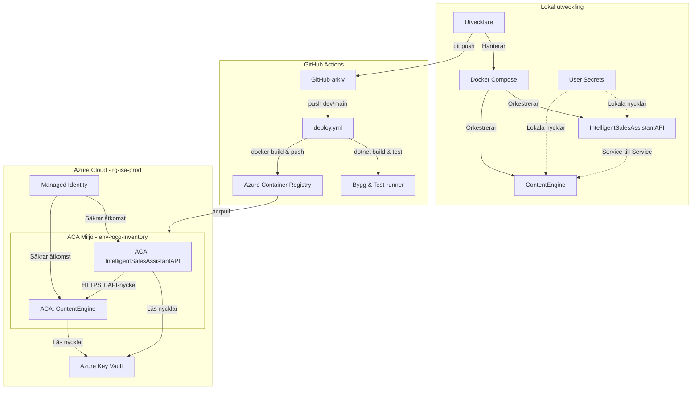

# Intelligent Sales Assistant - Enkel version (Pedagogisk guide)

[English](README.md) | [Svenska](README.sv.md) | [Enkel version (Svenska)](README.simple.md) | [Portfolio (English)](README.portfolio.md)

Välkommen! Den här guiden är skriven för dig som är nyfiken på hur detta system fungerar, men vill slippa den mest komplicerade tekniska jargongen. Vi förklarar hur applikationen fungerar med hjälp av enkla vardagsmetaforer.

---

### Systemöversikt

---

## Vad är en Mikrotjänst-arkitektur?

I stället för att bygga ett gigantiskt program (en så kallad monolit), är detta system uppdelat i två mindre program som samarbetar: **Service A** och **Service B**.

> **Köksmetaforen:**
> Tänk dig ett restaurangkök. Istället för att ha en enda kock som gör precis allt – tar beställningar, lagar maten, diskar och gör efterrätter – har vi delat upp arbetet:
> * **Service A (Hovmästaren & Kocken)**: Har hand om gästerna (användarna), kontrollerar deras legitimation (inloggning/säkerhet) och sätter ihop den slutliga tallriken (hemsidan).
> * **Service B (AI-Specialisten)**: Är en expert som bara fokuserar på en som sak: att prata med den externa AI-tjänsten (Google Gemini) för att få fram smarta texter.

---

## Vad är en LLM-Proxy och varför behövs den?

Service B fungerar som en **LLM-Proxy**. Det betyder att Service A aldrig pratar direkt med Google Gemini, utan går alltid via Service B.

> **Tolkmetaforen:**
> Föreställ dig att restaurangen behöver köpa en mycket speciell ingrediens från en utländsk leverantör (Google Gemini) som bara pratar ett språk. Istället för att alla i köket ska lära sig språket och bära runt på plånboken med betalkortet (API-nyckeln), har vi anställt en **tolk (Service B)**.
> 
> Hovmästaren (Service A) ber tolken: *"Fråga efter ett marknadsföringstextutkast för ett lokalt bageri"*. Tolken tar fram restaurangens hemliga kreditkort (API-nyckeln), pratar säkert med leverantören, får texten, och översätter den tillbaka till hovmästaren. Detta gör att det hemliga kortet aldrig lämnar tolkens rum (ökar säkerheten).

---

## JSON istället för färdig HTML (Lean Payload)

När Service B (AI-tjänsten) skickar tillbaka information till Service A skickar den inte en hel, färdigdesignad hemsida. Den skickar bara rådata i ett format som kallas JSON.

> **Receptmetaforen:**
> Om du vill bjuda en vän på en tårta kan du göra på två sätt:
> 1. Du kan köpa en färdig tårta och skicka den med posten (skicka hel HTML). Det är tungt, tar plats, riskerar att gå sönder och kostar mycket i frakt.
> 2. Du kan skicka ett litet SMS med ingredienserna och instruktionerna (skicka JSON). Din vän läser SMS:et och bakar snabbt tårtan själv i sitt eget kök.
> 
> Vårt system skickar bara "receptet" (JSON) mellan tjänsterna. Det är 20 gånger mindre och går extremt mycket snabbare över nätverket!

---

## Smart Token-besparing (Kostnadseffektivitet)

Jag har byggt systemet så att det är extremt kostnadseffektivt när det pratar med AI:n (Google Gemini). Istället för att skicka långa, komplicerade förfrågningar varje gång, anpassar systemet sig automatiskt efter hur mycket information som finns om företaget.

> **Beställningsmetaforen:**
> Tänk dig att du beställer mat på en restaurang:
> * **Enkelt företag (liten beställning):** "Jag vill ha en hamburgare" → Snabbt, billigt, tar 5 minuter
> * **Komplext företag (stor beställning):** "Jag vill ha en trerättersmiddag med speciella önskemål" → Tar längre tid, kostar mer, men du får exakt vad du vill ha
> 
> Systemet känner automatiskt av om företaget är "enkelt" eller "komplext" och väljer rätt strategi:
> * **Snabb strategi:** För små butiker med lite info → Använder ~700 tokens, tar 5-15 sekunder, kostar ~0,0001 kr
> * **Rik strategi:** För stora företag med mycket info → Använder ~2000 tokens, tar 15-30 sekunder, kostar ~0,0003 kr
> 
> **Varför detta är smart:**
> * Sparar 85-90% i AI-kostnader för enkla företag
> * Systemet är snabbt nog att 60 sekunders timeout alltid räcker
> * Lägre kostnader betyder att fler kan använda systemet

**Hur det fungerar tekniskt:**
Istället för att be AI:n skapa hela hemsidan med all HTML-kod, ber jag bara AI:n om innehållet (titlar, texter, tjänster) i JSON-format. Sedan fyller jag i färdiga HTML-mallar med det innehållet. Det är som att AI:n bara skriver manus, medan jag har färdiga scener att sätta in manuset i!

---

## Molnet och "Scale to Zero" (Skala till Noll)

Nu när systemet körs i produktion ligger det på Microsofts molntjänst (Azure Container Apps). Där använder vi en teknik som heter **Scale to Zero**.

> **Resursoptimering:**
> Tänk dig att du betalar för elektricitet. Istället för att ha lamporna tända dygnet runt även när ingen är hemma, släcks de automatiskt när du lämnar rummet och tänds igen när du kommer tillbaka.
> 
> Med *Scale to Zero* stängs våra digitala servrar av helt och hållet (skalar ner till 0 instanser) när ingen använder dem. Det kostar oss 0 kronor i molnavgift. Så fort en användare klickar på hemsidan startar servern blixtsnabbt upp igen automatiskt. Det sparar både pengar och miljö!

---

## Säkerhet på ett enkelt sätt: "Gäster och Låsta Dörrar"

För att skydda plattformen har vi infört ett antal säkerhetsspärrar (så kallad säkerhetshärdning):

### 1. Säkerhetsbur och gästanvändare (Rootless & Chiseled)
> **Hantverkarmetaforen:**
> Föreställ dig att du hyr in en målare för att måla om hemma (vår app). Istället för att ge målaren din husnyckel och full tillgång till alla rum, kassaskåpet och verktygslådan (vilket motsvarar att köra containern som administratör eller "root"), sätter du upp en strikt begränsad arbetszon.
>
> * **Gästanvändare (app):** Appen körs under ett begränsat konto (`app` med användar-id `1654`) som inte har nycklar till något annat än de mappar som den absolut måste måla i (databasen och hemsidemapparna).
> * **Borttagna verktyg (Chiseled):** Vi har tagit bort alla operativsystemets verktyg från containern – det finns inga hammare, borrar eller kofötter (inga kommandoskal som `bash`/`sh` eller pakethanterare som `apt`). Om en tjuv skulle ta sig in genom fönstret och låtsas vara målaren, finns det inga verktyg i rummet för att bryta sig vidare in i huset, vilket stoppar intrånget direkt.

### 2. Stängd dörr vid fel (Fail-Closed)
> **Säkerhetsdörrens kortläsare:**
> Tänk dig en säkerhetsdörr med kortläsare. Om strömmen går eller systemet slutar fungera, kan dörren ställas in på två sätt: antingen att låsa upp sig helt så vem som helst kan gå in (Fail-Open), eller att låsa sig helt så ingen kommer in utan nyckel (Fail-Closed). 
> 
> Vår app är inställd på **Fail-Closed**: om den interna säkerhetsnyckeln (`X-Api-Key`) saknas i inställningarna (till exempel på grund av en missad miljövariabel), stängs dörren till AI Content Engine omedelbart och appen ger ett felmeddelande (`500 Internal Server Error`). Det går aldrig att ta sig förbi säkerhetskontrollen av misstag.

### 3. Legitimation för grannar (CORS)
> **Dörrvaktsmetaforen:**
> När vi är hemma och testar appen lokalt är dörren lite mer öppen för enkelhetens skull (`DevPolicy`). Men när vi är i produktion i molnet har vi en strikt dörrvakt (`ApiPolicy`) som bara tillåter anrop från våra egna godkända adresser (till exempel vår frontend på `localhost:3000`). Alla andra anrop blockeras omedelbart.

---

## Säkerhetsgaranti

**Säkerhetsgaranti:** Systemets loggfunktioner är granskade och maskerar/exkluderar alla känsliga Authorization-headers och API-nycklar från loggströmmarna. Externa API-felsvar trunkeras till maximalt 200 tecken innan loggning för att förhindra läckage av nyckelrelaterad information. `ApiKeyHandler` är implementerad med ett strikt fail-closed-mönster: om API-nyckeln saknas i konfigurationen blockeras anropet omedelbart innan det lämnar applikationen.
