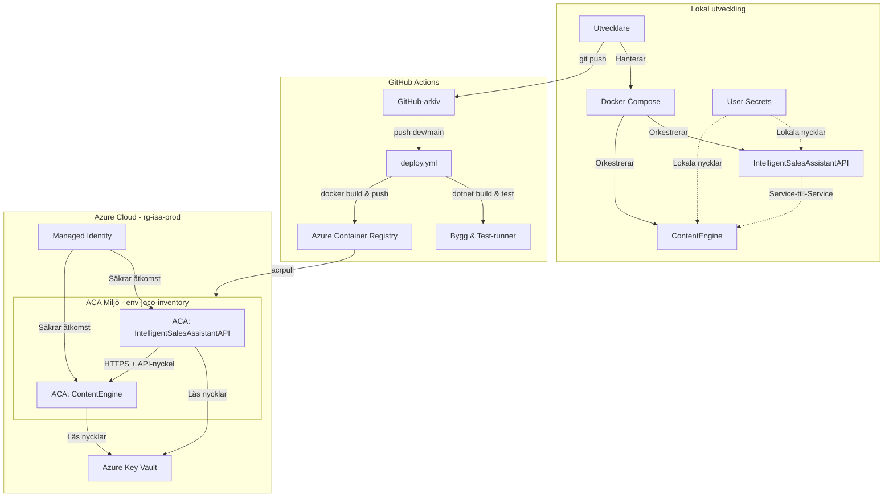

# Intelligent Sales Assistant - Enkel version (Pedagogisk guide)

[Svenska](README.md) | [English](README.en.md) | [Enkel version](README.simple.md) | [Portfolio](README.portfolio.md)

Välkommen! Den här guiden är skriven för dig som är nyfiken på hur detta system fungerar, men vill slippa den mest komplicerade tekniska jargongen. Vi förklarar hur applikationen fungerar med hjälp av enkla vardagsmetaforer.

---

### Systemöversikt

---

## Vad är en Mikrotjänst-arkitektur?

I stället för att bygga ett gigantiskt program (en så kallad monolit), är detta system uppdelat i två mindre program som samarbetar: **Service A** och **Service B**.

> **Köksmetaforen:**
> Tänk dig ett restaurangkök. Istället för att ha en enda kock som gör precis allt – tar beställningar, lagar maten, diskar och gör efterrätter – har vi delat upp arbetet:
> * **Service A (Hovmästaren & Kocken)**: Har hand om gästerna (användarna), kontrollerar deras legitimation (inloggning/säkerhet) och sätter ihop den slutliga tallriken (hemsidan).
> * **Service B (AI-Specialisten)**: Är en expert som bara fokuserar på en sak: att prata med den externa AI-tjänsten (Google Gemini) för att få fram smarta texter.

---

## Vad är en LLM-Proxy och varför behövs den?

Service B fungerar som en **LLM-Proxy**. Det betyder att Service A aldrig pratar direkt med Google Gemini, utan går alltid via Service B.

> **Tolkmetaforen:**
> Föreställ dig att restaurangen behöver köpa en mycket speciell ingrediens från en utländsk leverantör (Google Gemini) som bara pratar ett språk. Istället för att alla i köket ska lära sig språket och bära runt på plånboken med betalkortet (API-nyckeln), har vi anställt en **tolk (Service B)**.
> 
> Hovmästaren (Service A) ber tolken: *"Fråga efter en text för en bilfirma"*. Tolken tar fram restaurangens hemliga kreditkort (API-nyckeln), pratar säkert med leverantören, får texten, och översätter den tillbaka till hovmästaren. Detta gör att det hemliga kortet aldrig lämnar tolkens rum (ökar säkerheten).

---

## JSON istället för färdig HTML (Lean Payload)

När Service B (AI-tjänsten) skickar tillbaka information till Service A skickar den inte en hel, färdigdesignad hemsida. Den skickar bara rådata i ett format som kallas JSON.

> **Receptmetaforen:**
> Om du vill bjuda en vän på en tårta kan du göra på två sätt:
> 1. Du kan köpa en färdig tårta och skicka den med posten (skicka hel HTML). Det är tungt, tar plats, riskerar att gå sönder och kostar mycket i frakt.
> 2. Du kan skicka ett litet SMS med ingredienserna och instruktionerna (skicka JSON). Din vän läser SMS:et och bakar snabbt tårtan själv i sitt eget kök.
> 
> Vårt system skickar bara "receptet" (JSON) mellan tjänsterna. Det är 20 gånger mindre och går extremt mycket snabbare över nätverket!

---

## Molnet och "Scale to Zero" (Skala till Noll)

När systemet körs i produktion ligger det på Microsofts molntjänst (Azure Container Apps). Där använder vi en teknik som heter **Scale to Zero**.

> **Bilpoolsmetaforen:**
> Tänk dig att du har en bilpool. Istället för att betala en dyr månadshyra för en bil som oftast bara står parkerad på uppfarten, betalar du bara per minut när du faktiskt kör bilen.
> 
> Med *Scale to Zero* stängs våra digitala servrar av helt och hållet (skalar ner till 0 instanser) när ingen använder dem. Det kostar oss 0 kronor i molnavgift. Så fort en användare klickar på hemsidan startar servern blixtsnabbt upp igen automatiskt. Det sparar både pengar och miljö!
