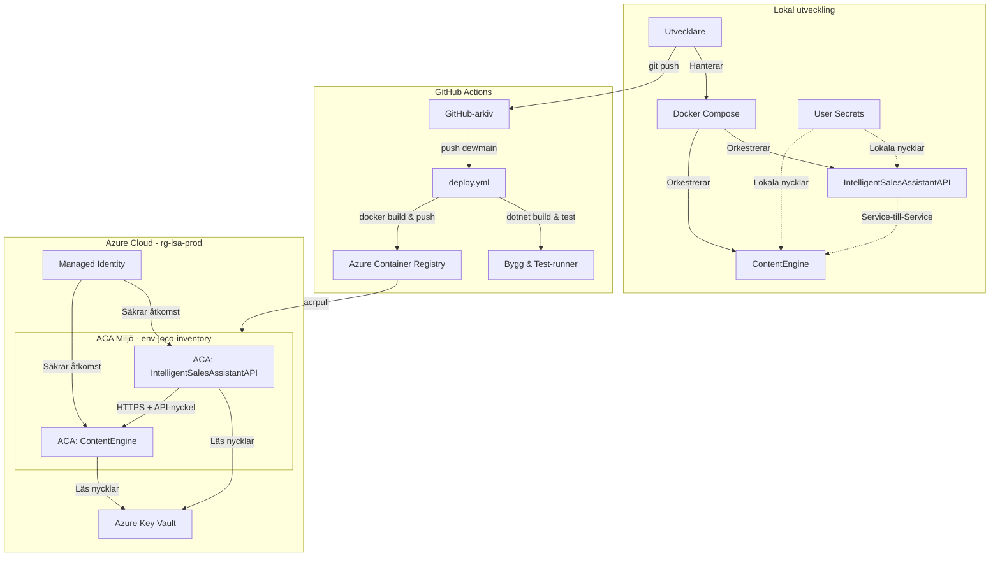

# Intelligent Sales Assistant Platform

[English](README.md) | [Svenska](README.sv.md) | [Enkel version (Svenska)](README.simple.md) | [Portfolio (English)](README.portfolio.md) | [Utvärdering & Säkerhet (AI)](evaluation.md)

**Live Demo:** [jocoborghol.se](https://jocoborghol.se)

> En distribuerad mikrotjänstplattform för AI-baserad generering av webbplatser och skräddarsytt företagsinnehåll

[](https://dotnet.microsoft.com/)
[](LICENSE)
[](docs)

---

### Systemöversikt



---

## Översikt

Intelligent Sales Assistant Platform är ett produktionsklart mikrotjänstsystem som automatserar säljflöden genom AI-driven innehållsgenerering. Plattformen hämtar företagsdata i realtid från svenska företagsregister och använder Google Gemini AI för att skapa professionella webbplatser och marknadsföringsmaterial.

**Kärnfunktioner:**
- Automatiserad företagsresearch via BolagsAPI (Svenska företagsregistret)
- AI-driven generering av webbplatser med anpassningsbara teman
- Skapande av marknadsföringsmaterial (sociala medier, e-post, nyhetsbrev)
- RESTful API med fullständig OpenAPI-dokumentation
- JWT-autentisering och rollbaserad behörighetskontroll

---

## Arkitektur

Plattformen implementerar en **mikrotjänstarkitektur** med två oberoende tjänster som kommunicerar via HTTP:

```
┌─────────────────────────────────────────────────────────────┐
│           IntelligentSalesAssistantAPI (Port 5267)          │
│                 Kärn-API & Affärslogik                      │
│                                                             │
│  ┌──────────────┐  ┌──────────────┐  ┌──────────────┐       │
│  │  Företags-   │  │  Webbplats-  │  │  Innehålls-  │       │
│  │  research    │  │  generering  │  │   utkast     │       │
│  └──────────────┘  └──────────────┘  └──────────────┘       │
│         │                  │                  │             │
│         └──────────────────┴──────────────────┘             │
│                            │                                │
│                   ┌────────▼────────┐                       │
│                   │  LlmProxyClient │                       │
│                   │  (Typed Client) │                       │
│                   └────────┬────────┘                       │
└────────────────────────────┼────────────────────────────────┘
                             │ HTTPS + API-nyckel
                             │ (Proxy-mönster)
┌────────────────────────────▼────────────────────────────────┐
│    IntelligentSalesAssistant.ContentEngine (Port 5006)      │
│                      AI Content Engine                      │
│                                                             │
│                   ┌────────────────┐                        │
│                   │ GeminiClient   │                        │
│                   │  (Typed HTTP)  │                        │
│                   └────────┬───────┘                        │
│                            │                                │
│                   ┌────────▼───────┐                        │
│                   │  Gemini API    │                        │
│                   │  (Google AI)   │                        │
│                   └────────────────┘                        │
└─────────────────────────────────────────────────────────────┘
```

### IntelligentSalesAssistantAPI
- **Ansvarsområde:** Affärslogik, datasamordning, användarautentisering
- **Teknologi:** ASP.NET Core Web API, Entity Framework Core, SQLite
- **Endpoints:** Företagsresearch, webbplatsgenerering, innehållsutkast
- **Säkerhet:** JWT-autentisering med rollerna Admin och Seller

### IntelligentSalesAssistant.ContentEngine
- **Ansvarsområde:** Proxy för AI-innehållsgenerering
- **Teknologi:** ASP.NET Core Web API, Google Gemini API-integration
- **Endpoints:** Textgenerering, strukturerat webbplatsinnehåll
- **Säkerhet:** API-nyckelvalidering för kommunikation mellan tjänster

### Architectural Decision Records (ADRs)
För detaljerade arkitekturbeslut och systemdesign, se våra ADR:er:
- [ADR 0001: Molnhosting & Containerhärdning](Docs/ADR/0001-val-av-molnhosting.md) - Beslut kring Azure Container Apps, Key Vault och rootless/distroless-körning.
- [ADR 0002: Versionshantering av utkast (Non-Destructive Editing)](Docs/ADR/0002-versionshantering-av-utkast.md) - Beslut kring hybrid-lagring (SQLite + disken) och återställningslogik.

---

## Kärnfunktioner

### Automatiserad företagsresearch
- Hämtar realtidsdata från BolagsAPI (Svenska företagsregistret)
- Cachas i minnet för den aktuella sessionen
- Tillhandahåller strukturerad företagsinformation (namn, organisationsnummer, adress, bransch)

### AI-driven webbplatsgenerering
- Genererar kompletta HTML/CSS/JavaScript-webbplatser
- Anpassningsbar ton (professionell, vänlig, djärv) och målgrupp
- Responsiv design med mobilfokuserade mallar
- Webbplatser sparas i `Site/generated/{company-name}/index.html`

### Skapande av marknadsföringsmaterial
- Skapar inlägg för sociala medier (Facebook, Instagram, LinkedIn)
- Genererar e-postmeddelanden, blogginlägg och nyhetsbrev
- Innehållet refererar till genererade webbplatser för konsekvent tonalitet
- Utkast sparas i `Site/drafts/{company-name}/{type}_{timestamp}.txt`

### Optimerad JSON-arkitektur (Lean Payload)
Kommunikationen mellan tjänsterna är optimerad för hög prestanda:
- **IntelligentSalesAssistant.ContentEngine** returnerar strukturerad JSON (3-5 KB)
- **IntelligentSalesAssistantAPI** bygger HTML lokalt utifrån mallar
- **Resultat:** 10-20x mindre datamängd över nätverket jämfört med att skicka hela HTML-filer

**Fördelar:**
- Minskad nätverksbelastning och snabbare svarstider
- Lägre bandbreddskostnader i molnet
- Tydlig ansvarsfördelning (AI-intelligens kontra presentation)
- Oberoende skalning baserat på faktisk belastning på respektive tjänst

### Smart Token-optimering & Kostnadseffektivitet

Jag implementerar en intelligent **kontextrik prompt-strategi** för att maximera AI-kvalitet samtidigt som kostnadseffektiviteten bibehålls:

**Min approach:** Använd alltid full kontext med smart prompt engineering:

#### Kontextrik strategi
För alla företag, oavsett datakomplexitet:
- **Full kontext:** All tillgänglig företagsdata (namn, bransch, stad, VD, anställda, tjänster)
- **Användaranpassning:** Ton, målgrupp, nyckelord, ägarcitat
- **Smarta instruktioner:** Detaljerade regler för professionellt, icke-AI-klingande innehåll
- **Token-användning:** ~1 500-2 500 tokens (input + output)
- **Genereringstid:** 15-30 sekunder
- **Kostnad per webbplats:** ~0,0003 kr (vid 0,15 kr/1M tokens)

**Kvalitet-först-strategi:**
```csharp
// Bygg alltid rik prompt med all tillgänglig kontext
var prompt = BuildPrompt(request); // Inkluderar all företagsdata + anpassning

// AI genererar endast innehåll (inte HTML-struktur)
var aiText = await _geminiClient.GenerateContentAsync(prompt, ct);
```

**Mallbaserad rendering:**
Istället för att be AI:n generera HTML:
1. Jag ber AI:n generera **endast innehåll** (titlar, beskrivningar, tjänster) som JSON
2. Jag fyller i färdiga HTML-mallar med AI-genererat innehåll
3. Resultat: AI:n fokuserar på kreativitet och kvalitet, inte HTML-struktur

**Varför detta är viktigt:**
- **Kvalitet först:** Rik kontext säkerställer professionellt, välskrivet innehåll
- **Kostnadseffektivt:** Mallbaserad approach sparar tokens (ingen HTML-generering)
- **Konsekvens:** Färdiga mallar säkerställer pålitlig struktur
- **Skalbarhet:** ~0,0003 kr per webbplats möjliggör högvolymbearbetning

**Ytterligare optimeringar jag implementerar:**
- Strukturerade JSON-svar (ingen markdown-parsning)
- Detaljerade prompt-regler för att undvika AI-klingande text
- Branschbaserad tjänstegenerering för fallbacks
- Cachad företagsdata (inga upprepade API-anrop)
- Smart sanering (tar bort AI-artefakter som "Företagsnamn: tagline")

Denna arkitektur demonstrerar produktionsklar kvalitetsoptimering samtidigt som kostnadseffektiviteten bibehålls.

---

## Teknikstack

| Kategori | Teknologi |
|----------|-----------|
| **Ramverk** | .NET 9.0 |
| **Programspråk** | C# 12 |
| **API** | ASP.NET Core Web API |
| **ORM** | Entity Framework Core |
| **Databas** | SQLite |
| **HTTP-klient** | IHttpClientFactory med Typed Clients |
| **Resiliens** | Polly (Retry, Circuit Breaker, Timeout) |
| **Autentisering** | JWT Bearer Tokens |
| **API-dokumentation** | Scalar (OpenAPI 3.0) |
| **AI-leverantör** | Google Gemini API (gemini-3.1-flash-lite-preview) |
| **Externa API:er** | BolagsAPI (Svenska företagsregistret) |

---

## Komma igång

### Förutsättningar

- [.NET 9 SDK](https://dotnet.microsoft.com/download/dotnet/9.0) eller senare
- [Git](https://git-scm.com/)
- API-nycklar:
  - [Google Gemini API-nyckel](https://ai.google.dev/)
  - [BolagsAPI-nyckel](https://bolagsapi.se/)

### Installation

1. **Klona arkivet**
   ```bash
   git clone https://github.com/JocoBorghol/AI-Microservices.git
   cd AI-Microservices
   ```

2. **Återställ NuGet-paket**
   ```bash
   dotnet restore
   ```
   Detta säkerställer att alla beroenden laddas ner lokalt före konfigurationen.

3. **Konfigurera User Secrets för IntelligentSalesAssistantAPI**
   ```bash
   cd IntelligentSalesAssistantAPI
   dotnet user-secrets init
   dotnet user-secrets set "Jwt:Key" "din-superhemliga-jwt-nyckel-minst-32-tecken"
   dotnet user-secrets set "AdminPassword" "ditt-admin-lösenord"
   dotnet user-secrets set "SellerPassword" "ditt-säljar-lösenord"
   dotnet user-secrets set "BolagsApi:ApiKey" "din-bolagsapi-nyckel"
   dotnet user-secrets set "LlmProxySettings:ApiKey" "din-interna-api-nyckel-för-service-b"
   ```

4. **Konfigurera User Secrets för IntelligentSalesAssistant.ContentEngine**
   ```bash
   cd ../IntelligentSalesAssistant.ContentEngine
   dotnet user-secrets init
   dotnet user-secrets set "GeminiSettings:ApiKey" "din-gemini-api-nyckel"
   dotnet user-secrets set "ServiceAuth:ApiKey" "din-interna-api-nyckel-för-service-b"
   ```
   
   > **Obs:** Värdet för `ServiceAuth:ApiKey` i ContentEngine måste matcha `LlmProxySettings:ApiKey` i IntelligentSalesAssistantAPI.
   
   > **AI-integration:** `GeminiSettings:ApiKey` krävs för att AI Content Engine ska kunna kommunicera med Google Gemini API. Utan denna nyckel kan plattformen inte generera texter.

5. **Tillämpa databasmigreringar**
   ```bash
   cd ../IntelligentSalesAssistantAPI
   dotnet ef database update
   ```

### Köra tjänsterna

**Terminal 1 - IntelligentSalesAssistantAPI:**
```bash
cd IntelligentSalesAssistantAPI
dotnet run
```
Tjänsten startar på `http://localhost:5267`

**Terminal 2 - IntelligentSalesAssistant.ContentEngine:**
```bash
cd IntelligentSalesAssistant.ContentEngine
dotnet run
```
Tjänsten startar på `http://localhost:5006`

### Köra via Docker Compose (Alternativ)

Innan du kör systemet i Docker måste du skapa en lokal `.env`-fil i rotmappen för att säkert skicka in lösenord och nycklar till containrarna (utan att råka checka in dem i Git). 

Skapa filen `.env` i samma mapp som `docker-compose.yml` och klistra in följande:

```env
ServiceAuth__ApiKey=din-interna-api-nyckel-för-service-b
Jwt__Key=din-superhemliga-jwt-nyckel-minst-32-tecken
AdminPassword=ditt-valfria-admin-lösenord
SellerPassword=ditt-valfria-säljar-lösenord
```

Starta därefter systemet:
```bash
# Bygg och starta båda mikrotjänsterna i bakgrunden från rotmappen
docker-compose up -d --build
```
När tjänsterna har startat körs de som rootless (internt på port 8080) och är mappade till värddatorn enligt följande:
- **IntelligentSalesAssistantAPI:** Värdport `5267` -> Containerport `8080` (nås på `http://localhost:5267/scalar/v1`)
- **IntelligentSalesAssistant.ContentEngine:** Värdport `5000` -> Containerport `8080` (nås på `http://localhost:5000/scalar/v1`)

### Verifiera installationen

- **IntelligentSalesAssistantAPI:** `http://localhost:5267/scalar/v1`
- **IntelligentSalesAssistant.ContentEngine:** `http://localhost:5006/scalar/v1` (eller `http://localhost:5000/scalar/v1` när du kör via Docker Compose)

---

## Snabbguide (Quick Start)

### 1. Autentisera dig

```bash
curl -X POST http://localhost:5267/api/auth/login \
  -H "Content-Type: application/json" \
  -d '{
    "username": "admin",
    "password": "ditt-admin-lösenord"
  }'
```

Spara den returnerade JWT-token.

### 2. Gör research på ett företag

```bash
curl -X POST http://localhost:5267/api/research \
  -H "Content-Type: application/json" \
  -H "Authorization: Bearer DIN_JWT_TOKEN" \
  -d '{
    "orgNumber": "5565093902"
  }'
```

Detta hämtar företagsdata från BolagsAPI och sparar det i minnescachen.

### 3. Generera en webbplats

```bash
curl -X POST http://localhost:5267/api/websites \
  -H "Content-Type: application/json" \
  -H "Authorization: Bearer DIN_JWT_TOKEN" \
  -d '{
    "customization": {
      "tone": "professional and welcoming",
      "targetAudience": "families with children",
      "topServices": ["Candy", "Chocolate", "Gift Cards"],
      "keywords": ["quality", "tradition", "joy"]
    }
  }'
```

### 4. Visa den genererade webbplatsen

Öppna webbadressen från svaret:
```
http://localhost:5267/generated/kandyz-ab/index.html
```

### 5. Skapa marknadsföringsmaterial

```bash
curl -X POST http://localhost:5267/api/content/drafts \
  -H "Content-Type: application/json" \
  -H "Authorization: Bearer DIN_JWT_TOKEN" \
  -d '{
    "contentType": "facebook_post",
    "instructions": "Skapa ett roligt inlägg om våra sommaröppettider",
    "tone": "casual",
    "websiteId": 1
  }'
```

---

## API-dokumentation

### IntelligentSalesAssistantAPI Endpoints

| Endpoint | Metod | Beskrivning |
|----------|-------|-------------|
| `/api/auth/login` | POST | Generera JWT-token |
| `/api/research` | POST | Hämta företagsdata från BolagsAPI |
| `/api/research/cache` | GET | Hämta och visa cachad företagsdata |
| `/api/research/cache` | DELETE | Rensa cachad företagsdata |
| `/api/websites` | GET | Lista alla genererade webbplatser |
| `/api/websites` | POST | Generera en ny webbplats |
| `/api/websites/{id}` | GET | Hämta webbplatsinformation |
| `/api/websites/{id}` | PUT | Regenerera webbplats |
| `/api/websites/{id}` | DELETE | Ta bort webbplats |
| `/api/websites/{id}/theme` | PATCH | Byt webbplatstema utan att regenerera |
| `/api/websites/{id}/contact` | PATCH | Uppdatera kontaktuppgifter i genererad HTML |
| `/api/websites/{id}/content` | PATCH | Uppdatera textinnehåll i genererad HTML |
| `/api/websites/{id}/images` | POST | Ladda upp egna bilder (hero, about, tjänster) |
| `/api/content/drafts` | POST | Skapa innehållsutkast (kräver websiteId) |
| `/api/content/drafts` | GET | Lista alla utkast |
| `/api/content/drafts/{id}` | GET | Hämta specifikt utkast |
| `/api/content/drafts/{id}` | DELETE | Ta bort utkast |

**Webbplatsanpassning:** Efter att en webbplats har genererats kan kunder använda PATCH-endpoints för att finjustera specifika element (tema, kontaktinfo, textinnehåll) utan att regenerera hela webbplatsen. Detta möjliggör snabba iterationer och personalisering direkt från frontend.

### IntelligentSalesAssistant.ContentEngine Endpoints

| Endpoint | Metod | Beskrivning |
|----------|-------|-------------|
| `/api/content/generate` | POST | Generera AI-textinnehåll |
| `/api/content/websites` | POST | Generera strukturerat webbplatsinnehåll |

Scalar interaktiv dokumentation finns tillgänglig på `http://localhost:5267/scalar/v1` när tjänsterna körs.

---

## Exception Middleware (Felhantering)

Plattformen implementerar en centraliserad Custom Exception Middleware för robust felhantering och säkerhet. Istället för råa systemstackspår fångar denna middleware upp alla fel och omvandlar dem till standardiserade **RFC 7807 Problem Details**-svar.

**Arkitektur:** Middlewareregistreringen sker i `Program.cs`. Den använder en `try-catch`-struktur runt `next(context)`-delegaten vilket säkerställer att alla undantag som uppstår under en request fångas upp, loggas och mappas till ett strukturerat `ProblemDetails`-svar via klassen `Microsoft.AspNetCore.Mvc.ProblemDetails`.

**Viktiga fördelar:**
- **Säkerhet:** Förhindrar att känslig systeminformation läcks till klienten
- **Konsekvens:** Ger ett enhetligt felformat för alla mikrotjänster
- **Tydlighet:** Mappar specifika domänfel (t.ex. `FileOperationException`, `CompanyNotFoundException`) till korrekta HTTP-statuskoder

**Så här testar och verifierar du:**
1. Autentisera dig via `/api/auth/login` för att erhålla en JWT-token
2. Anropa `POST /api/research` med ett ogiltigt eller icke-existerande organisationsnummer (t.ex. `"000"`)
3. Kontrollera svaret: API:et returnerar ett strukturerat JSON-objekt med fälten `title`, `status` och `detail` istället för en ostrukturerad felsida

**Exempel på felsvar:**
```json
{
  "type": "https://tools.ietf.org/html/rfc7231#section-6.5.4",
  "title": "Företag hittades inte",
  "status": 404,
  "detail": "Företag med organisationsnummer 000 hittades inte i BolagsAPI"
}
```

---

## Säkerhet & Härdning

> [!NOTE]
> För en detaljerad utvärdering av vår säkerhetsdesign mot Prompt Injection (OWASP LLM01) och våra kvalitetskriterier för AI-generering, se [Rapporten för utvärdering av AI-resultat & Säkerhet](evaluation.md).

### Autentiseringsflöde
1. Användaren loggar in via `/api/auth/login` och får en JWT-token
2. JWT-token skickas med i headern `Authorization: Bearer {token}` för efterföljande anrop
3. IntelligentSalesAssistantAPI validerar JWT-token och utvinner användaridentiteten
4. IntelligentSalesAssistantAPI bifogar en intern API-nyckel vid anrop till ContentEngine
5. ContentEngine validerar API-nyckeln innan förfrågan behandlas

### Säkerhetsfunktioner
- **JWT-autentisering:** Tokens med 2 timmars giltighetstid och validering av utfärdare (issuer), målgrupp (audience) och signeringsnyckel.
- **Rollbaserad behörighet (RBAC):** Admin- och Seller-roller mappade via claims för endpoint-auktorisering.
- **API-nyckelvalidering (Service-to-Service):** Härdad header-baserad API-nyckelvalidering för säkra anrop mellan mikrotjänster.
- **Indatavalidering:** Tvingande indatavalidering via Data Annotations och ModelState-kontroll.
- **SQL-injektionsskydd:** Automatisk parameterisering av SQL-anrop via Entity Framework Core.
- **Rate limiting:** IP-baserad rate limiting med fast fönster (10 anrop/minut per endpoint) för att skydda mot överbelastning.

### Containerhärdning (Rootless & Distroless)
- **Distroless bas-image (Ubuntu Chiseled):** Produktionscontainrarna körs på `mcr.microsoft.com/dotnet/aspnet:9.0-noble-chiseled`. Denna slimmade bas-image saknar helt kommandoskal (`sh`, `bash`), GNU-verktyg (`curl`, `wget`) och pakethanterare (`apt`). Detta minimerar attackytan för post-exploitation till nära noll.
- **Rootless exekvering:** Processen är konfigurerad att köras under den inbyggda, icke-privilegierade användaren `app` (UID `1654`, GID `1654`) istället för som `root` (UID `0`).
- **Port 8080-bindning:** För att följa rootless-restriktioner (där portar under 1024 kräver root-rättigheter), lyssnar båda containrarna internt på port `8080` (via `ASPNETCORE_URLS=http://+:8080` och `EXPOSE 8080`).
- **Säker filhantering utan kommandoskal:** För att stödja databasskrivning (`ServiceA.db` i `Data/`) och webbplatsgenerering (`Site/generated`), skapas katalogerna under bygg- och publiceringsfasen, och kopieras sedan över med ändrat ägarskap:
  ```dockerfile
  COPY --from=publish --chown=app:app /app/publish .
  COPY --from=publish --chown=app:app /app/Site /Site
  ```
  Detta ger användaren `app` fulla läs- och skrivbehörigheter utan att containern behöver innehålla ett kommandoskal eller externa verktyg.

### Applikationshärdning (C#)
- **Miljö-villkorad CORS:** För att förhindra Cross-Origin Resource Sharing (CORS)-attacker i produktion är den öppna policyn `DevPolicy` (som tillåter alla domäner) begränsad till utvecklingsmiljön (`Development`). I produktion tillämpas den strikta policyn `ApiPolicy` som begränsar godkända ursprung till listade domäner:
  ```csharp
  if (app.Environment.IsDevelopment())
  {
      app.UseCors("DevPolicy");
  }
  else
  {
      app.UseCors("ApiPolicy");
  }
  ```
- **Fail-Closed API-nyckelvalidering:** Filtret `RequireApiKeyAttribute.cs` har härdats för att stängas vid fel ("fail-closed"). Om API-nyckeln saknas i konfigurationen (t.ex. på grund av felaktig Key Vault-koppling), avbryter filtret direkt anropet och returnerar ett explicit `500 Internal Server Error` (i RFC 7807 Problem Details-format) till klienten istället för att bypassa kontrollen.

### Så här sätter du API-nyckeln lokalt (User Secrets)
Under lokal utveckling lagras alla känsliga nycklar utanför projektmappen med hjälp av .NET User Secrets för att förhindra att de oavsiktligt checkas in i Git.
1. Gå till API-projektets katalog:
   ```bash
   cd IntelligentSalesAssistantAPI
   ```
2. Sätt API-nyckeln för kommunikation med Service B (Content Engine):
   ```bash
   dotnet user-secrets set "LlmProxySettings:ApiKey" "din_lokala_hemliga_nyckel"
   ```
Denna nyckel läses automatiskt in i `IConfiguration` under utveckling via det unika `UserSecretsId` i `.csproj`.

### Så här sätter du API-nyckeln i produktion (Environment Variables)
Applikationen är driftsatt i den delade miljön env-joco-inventory i resursgruppen rg-isa-prod.
- Känsliga nycklar binds som miljövariabler, där t.ex. `LlmProxySettings__ApiKey` mappar mot `LlmProxySettings:ApiKey` i konfigurationen.
- **Bästa praxis:** Nycklar lagras säkert i **Azure Key Vault** och kopplas till miljövariabler i Azure Container Apps med en systemtilldelad **Managed Identity** (med rollen `Key Vault Secrets User`), vilket gör att applikationen aldrig hanterar råa lösenord i kod eller deploy-skript.

### CI/CD via GitHub Actions
Pipelinen (.github/workflows/deploy.yml) bygger, testar och driftsätter båda mikrotjänsterna automatiskt vid pull requests och push-händelser till dev och main-brancherna. För att detta ska fungera behöver du:
1. Skapa en Service Principal i Azure CLI:
   ```bash
   az ad-sp create-for-rbac --name "github-actions-deploy" \
     --role contributor \
     --scopes /subscriptions/YOUR_SUBSCRIPTION_ID/resourceGroups/YOUR_RESOURCE_GROUP \
     --sdk-auth
   ```
   Ersätt `YOUR_SUBSCRIPTION_ID` med ditt Azure Subscription ID och `YOUR_RESOURCE_GROUP` med namnet på din resursgrupp.
2. Kopiera den resulterande JSON-koden.
3. Gå till ditt GitHub-arkiv: **Settings > Secrets and variables > Actions**.
4. Skapa en ny secret med namnet `AZURE_CREDENTIALS` och klistra in JSON-koden.

### Auktorisering & Endpoint-säkerhet

Jag implementerar omfattande auktorisering över alla API-endpoints för att säkerställa datasäkerhet och korrekt åtkomstkontroll:

**Auktoriseringsstrategi:**
- **JWT-baserad autentisering** för alla användarriktade endpoints
- **API-nyckelvalidering** för service-till-service-kommunikation
- **Rollbaserad åtkomstkontroll** (Admin/Seller) för administrativa funktioner
- **Ingen anonym åtkomst** förutom login-endpointen

**Sammanfattning av endpoint-skydd:**

| Controller | Auktorisering | Endpoints | Status |
|------------|---------------|-----------|--------|
| **WebsiteGeneratorController** | `[Authorize]` | 9 endpoints (GET, POST, PUT, PATCH, DELETE) | ✅ Skyddad |
| **ContentDraftController** | `[Authorize]` | 6 endpoints (GET, POST, PUT, DELETE) | ✅ Skyddad |
| **CompanyResearchController** | `[Authorize]` | 3 endpoints (POST, GET, DELETE cache) | ✅ Skyddad |
| **AdminController** | `[Authorize(Roles = "Admin")]` | 2 endpoints (registrera säljare, systeminfo) | ✅ Rollskyddad |
| **AuthController** | Ingen auktorisering | 1 endpoint (login) | ✅ Korrekt öppen |
| **ContentController** | `[RequireApiKey]` | 1 endpoint (generera innehåll) | ✅ API-nyckelskyddad |

**Viktiga säkerhetsprinciper:**
- ✅ Alla endpoints som skapar, modifierar eller raderar data kräver autentisering
- ✅ Alla GET-endpoints som returnerar känslig data kräver autentisering
- ✅ Inga `[AllowAnonymous]`-attribut som kan kringgå säkerhet
- ✅ Service-till-service-kommunikation säkrad med API-nyckelvalidering
- ✅ Admin-funktioner begränsade till endast Admin-roll

**Felhantering & säkerhet:**

Jag implementerar RFC 7807 Problem Details för alla felsvar med korrekt statuskodsmappning:
- **401 Unauthorized** - Ogiltig eller saknad JWT-token
- **403 Forbidden** - Giltig token men otillräckliga behörigheter
- **429 Too Many Requests** - Rate limit överskriden (AI-tjänst överbelastad)
- **504 Gateway Timeout** - Request timeout (AI-generering tog för lång tid)

**Graceful Degradation:**
- **Development:** Detaljerade felmeddelanden med stack traces för felsökning
- **Production:** Generiska felmeddelanden utan interna systemdetaljer
- **Ingen läckage av känslig data:** Bearer tokens, API-nycklar och headers loggas aldrig

### Skriftlig säkerhetsgaranti
Härmed intygas och garanteras att:
- Inga råa API-nycklar eller hemligheter är eller kommer att checkas in i Git-arkivet (all lokal konfiguration sker via User Secrets eller miljöspecifika platshållare).
- Alla API-klienter och HTTP-handlers (`ApiKeyHandler`, `BolagsApiAuthHandler`) samt vår globala middleware (`CustomExceptionMiddleware`) är manuellt och programmatiskt verifierade att **aldrig** logga känsliga HTTP-headers (t.ex. `Authorization`, `X-Api-Key`) eller råa request-kroppar innehållande användardata och tokens. Endast säkra, anonymiserade felmeddelanden loggas i systemet.

**Säkerhetsgaranti:** Systemets loggfunktioner är granskade och maskerar/exkluderar alla känsliga Authorization-headers och API-nycklar från loggströmmarna. Externa API-felsvar trunkeras till maximalt 200 tecken innan loggning för att förhindra läckage av nyckelrelaterad information. `ApiKeyHandler` är implementerad med ett strikt fail-closed-mönster: om API-nyckeln saknas i konfigurationen blockeras anropet omedelbart innan det lämnar applikationen.

---

## Projektstruktur

```
AI-Microservices/
├── IntelligentSalesAssistantAPI/             # Huvud-API
│   ├── Controllers/                          # API-Controllers
│   │   ├── AuthController.cs                 # JWT-Autentisering
│   │   ├── CompanyResearchController.cs      # BolagsAPI-integration
│   │   ├── WebsiteGeneratorController.cs     # Webbplatsgenerering
│   │   └── ContentDraftController.cs         # Innehållsutkast
│   ├── Services/                             # Affärslogik
│   │   ├── Enrichment/                       # Företagsresearch
│   │   ├── WebsiteGenerator/                 # Webbplatsgenerering
│   │   └── ContentDraft/                     # Innehållsutkast
│   ├── Http/Clients/                         # Typed HTTP-klienter
│   ├── DTOs/                                 # Data Transfer Objects
│   ├── Data/                                 # Databaskontext
│   ├── Models/                               # Entitetsmodeller
│   │   └── CompanyWebsite.cs                 # Webbplatsentitet
│   ├── Middleware/                           # Custom Middleware
│   ├── Filters/                              # Action Filters
│   ├── Exceptions/                           # Custom Exceptions
│   ├── Migrations/                           # EF Core-migreringar
│   ├── ServiceA.db                           # SQLite-databas
│   └── Program.cs                            # Applikationens startpunkt
│
├── IntelligentSalesAssistant.ContentEngine/  # AI Content Engine (Service B)
│   ├── Controllers/                          # API-Controllers
│   │   └── ContentController.cs              # AI-textgenerering
│   ├── ApiClients/                           # Gemini-klient
│   │   ├── GeminiClient.cs                   # Gemini API-integration
│   │   └── IGeminiClient.cs                  # Interface
│   ├── Security/                             # API-nyckelvalidering
│   │   └── RequireApiKeyAttribute.cs         # API-nyckelfilter
│   ├── Middleware/                           # Custom Middleware
│   ├── DTOs/                                 # Data Transfer Objects
│   └── Program.cs                            # Application Entry Point
│
├── Site/                                     # Genererat innehåll
│   ├── template/                             # Webbplatsmallar
│   │   └── index.html                        # Basmall
│   ├── generated/                            # Genererade webbplatser
│   │   └── {company-name}/                   # Företagsspecifika mappar
│   │       └── index.html                    # Genererad webbsida
│   └── drafts/                               # Innehållsutkast
│   │   └── {company-name}/                   # Företagsspecifika mappar
│   │       └── {type}_{timestamp}.txt        # Utkastsfiler
│   │
│   ├── README.md                             # Huvud-README (Engelska)
│   ├── README.sv.md                          # Denna fil (Svenska)
│   ├── README.simple.md                      # Enkel version (Svenska)
│   └── README.portfolio.md                   # Portfolio-version (Engelska)
```

---

## Testning

### Manuell testning med Scalar

1. Starta båda tjänsterna
2. Gå till `http://localhost:5267/scalar/v1`
3. Klicka på "Authorize" och fyll i din JWT-token
4. Testa endpoints direkt via det interaktiva gränssnittet

### Exempel på testflöde

**Komplett generering av hemsida:**
1. POST `/api/auth/login` - Autentisera och hämta JWT-token
2. POST `/api/research` - Hämta företagsdata (sparas i cache)
3. POST `/api/websites` - Generera webbplats baserad på cache
4. GET `/api/websites` - Lista alla genererade webbplatser
5. Öppna den genererade webbplatsen i en webbläsare

**Skapa innehållsutkast:**
1. POST `/api/auth/login` - Autentisera
2. POST `/api/research` - Hämta företagsdata
3. POST `/api/websites` - Generera webbplats
4. POST `/api/content/drafts` - Skapa utkast (skicka med websiteId från steg 3)
5. GET `/api/content/drafts/{id}` - Visa det genererade utkastet

---

## Bidra till projektet

Detta är ett portföljprojekt för att demonstrera mikrotjänstarkitektur och AI-integration. Feedback och förbättringsförslag är varmt välkomna!

---

## Utvecklare

**Joco Borghol**
- LinkedIn: [linkedin.com/in/joco-borghol-777b59386](https://www.linkedin.com/in/joco-borghol-777b59386)
- GitHub: [@JocoBorghol](https://github.com/JocoBorghol)

---

## Tack till

- **Google Gemini AI** - AI-genererat innehåll
- **BolagsAPI** - Företagsdata i realtid
- **Scalar** - Interaktiv API-dokumentation
- **Polly** - Resiliens och transientfelhantering

---

<div align="center">

**Byggd med .NET 9 och modern mikrotjänstarkitektur**

[⬆ Tillbaka till toppen](#intelligent-sales-assistant-platform)

</div>
